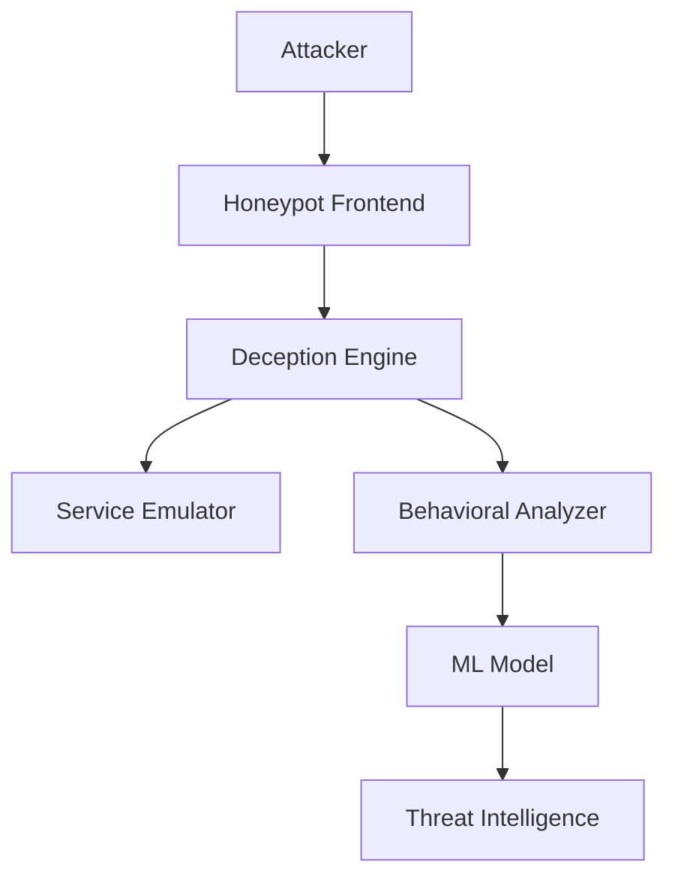

# 🎯 Adaptive AI Honeypot System with Attacker Behavioral Profiling

[](https://www.python.org/)
[](LICENSE)


## 📋 Table of Contents
- [Overview](#-overview)
- [Key Features](#-key-features)
- [Architecture](#-architecture)
- [Installation](#-installation)
- [Usage](#-usage)
- [Security Considerations](#-security-considerations)
- [Contributing](#-contributing)
- [Documentation](#-documentation)
- [License](#-license)

## 🔍 Overview

This project is a basic honeypot system designed to simulate services and monitor attacker behavior. It captures incoming connections and logs them for analysis, helping in understanding attack patterns in a controlled environment.

### What Makes It Different?
- **Adaptive Responses**: Unlike traditional static honeypots, our system learns and evolves.
- **Real-time Analysis**: Continuous monitoring and analysis of attacker behavior.
- **Intelligent Deception**: Dynamic service emulation that adapts to attack patterns.

## 🚀 Key Features

### Core Capabilities
- **Dynamic Service Emulation**
  - Configurable port listening
  - Service behavior mimicking
  - Adaptive response generation


### Security Features
- **Isolated Environment**
  - Containerized services
  - Resource limitation
  - Access control

### Monitoring & Analysis
- **Real-time Monitoring**
  - Traffic analysis
  - Attack visualization
  - Alert generation

## 🏗 Architecture



## 💻 Installation

### Prerequisites
- Python 3.8+
- Virtual Environment

### Step-by-Step Setup
1. **Clone the Repository**
   ```bash
   git clone https://github.com/arindamtiwari/adaptive-ai-honeypot.git
   cd adaptive-ai-honeypot
   ```

2. **Create Virtual Environment**
   ```bash
   python3 -m venv venv
   source venv/bin/activate  # On Windows: venv\Scripts\activate
   ```

3. **Install Dependencies**
   ```bash
   pip install -r requirements.txt
   ```

## 🎮 Usage

### Basic Operation
```bash
# Start the honeypot
PYTHONPATH=$PYTHONPATH:. python src/honeypot.py

# Monitor logs
tail -f logs/honeypot_*.log
```

### Advanced Configuration
Edit `config.yaml` to customize:
- Port configurations
- Service behaviors
- Logging options

## 🛡 Security Considerations

⚠️ **Important Warnings**:
- Never expose the honeypot directly to the internet
- Always run in a controlled environment
- Regularly monitor system resources
- Keep all dependencies updated
  

## 📚 Documentation

Detailed documentation is available in the [docs](docs/) directory:
- [Technical Overview](docs/technical-overview.md)
- [API Reference](docs/api-reference.md)
- [Deployment Guide](docs/deployment.md)
  
This project is currently under development. Documentation will be added in future updates.

## 📝 License

This project is licensed under the MIT License - see the [LICENSE](LICENSE) file for details.

---


👨‍💻 Note

This project is created for academic learning and cybersecurity exploration purposes.
